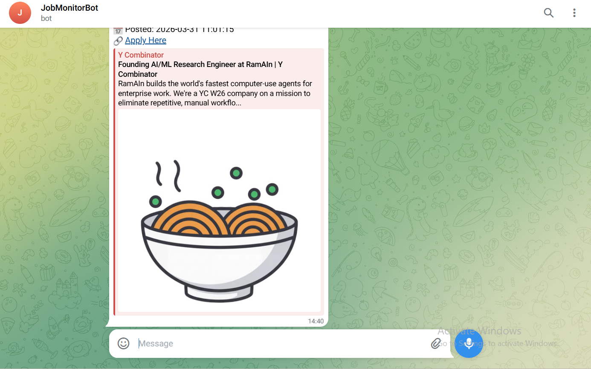

# HN Job Monitor 🔍
> Built for developers and job seekers who want instant alerts for new tech jobs on HackerNews without manually checking every hour.

Automated job monitoring system that scrapes HackerNews Jobs API every hour and sends instant Telegram alerts for new postings.

## What it does
- Scrapes HackerNews Jobs API automatically every hour
- Stores jobs in PostgreSQL database with duplicate detection
- Sends instant Telegram notifications for new jobs only
- REST API with public endpoints
- Dashboard to view all tracked jobs
- Deployed 24/7 on Render

## Tech Stack
- Python
- FastAPI
- PostgreSQL (Supabase)
- Telegram Bot API
- Render (deployment)
- cron-job.org (scheduling)

## Endpoints
| Endpoint | Description |
|----------|-------------|
| `/` | Health check |
| `/jobs` | Get all jobs as JSON |
| `/run` | Trigger scraper manually |
| `/dashboard` | View jobs in browser |

## Live Demo
- Dashboard: https://hn-job-monitor.onrender.com/dashboard
- API: https://hn-job-monitor.onrender.com/jobs

## Screenshots



## Setup
1. Clone the repo
2. Create `.env` with `BOT_TOKEN`, `CHAT_ID`, `DATABASE_URL`
3. Install requirements: `pip install -r requirements.txt`
4. Run locally: `uvicorn main:app --host 0.0.0.0 --port 10000`
5. Deploy to Render and connect Supabase PostgreSQL

## How it works
```
cron-job.org (every hour)
        ↓
FastAPI /run endpoint
        ↓
Scraper fetches new job IDs from HN API
        ↓
New IDs saved to PostgreSQL (Supabase)
        ↓
Telegram alert sent for each new job
```